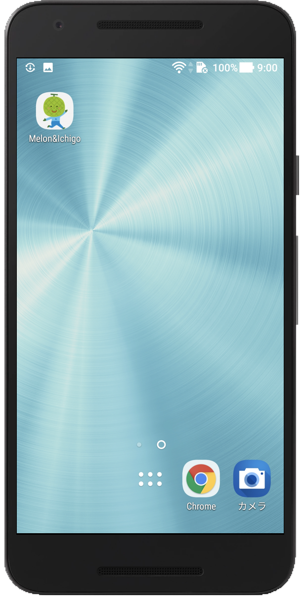
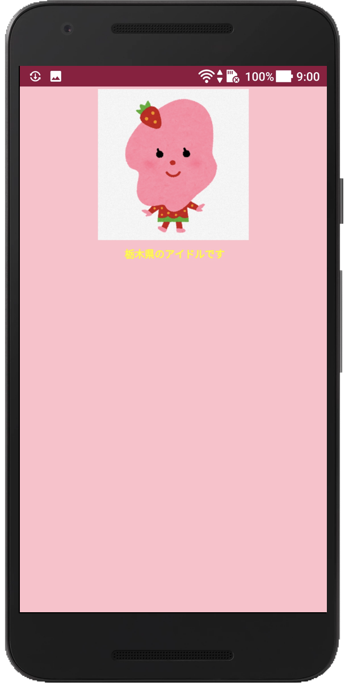

# add-home-minimum

## preview

- https://mqtsuo02.github.io/add-home-minimum/

|home icon|app|
|:-:|:-:|
|  |  |

## desctiption

- 「ホームに追加」するとネイティブアプリのように立ち上がる Web のサンプルコード

## log

- 適当に index.html を作る
- [Web App Manifest Generator](https://app-manifest.firebaseapp.com/) で manifest 自動生成
- 生成した manifest と imeges をディレクトリ内に持ってくる
- manifest を index.html の head で読み込む
- 以上
